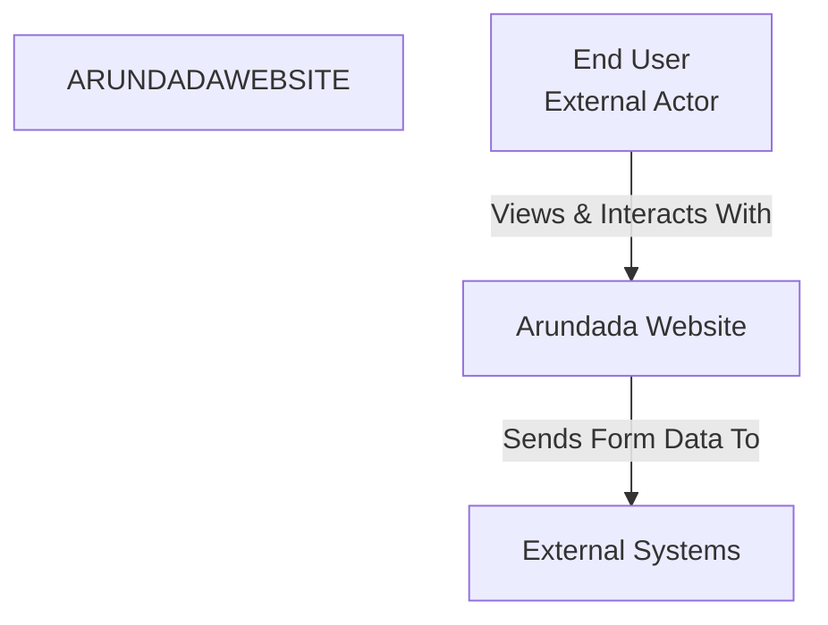

# System Context

## I am working on a software system with the following directory structure, architecture, and analyzed files:

## Directory Structure
```
ARUNDADAWEBSITE
├── public
│   └── index.html
├── src
│   ├── assets
│   │   └── scissors-svgrepo-com.svg
│   ├── css
│   │   └── styles.css
│   ├── images
│   │   ├── 42C1562F-D81E-4E07-A2D1-2C45C4A59ACB.JPG
│   │   ├── 42E00D3C-EEC6-4E12-B4F4-220479ED582B.JPG
│   │   ├── CA7C329D-DEA0-466D-9B6C-9FC2340FFAC3.JPG
│   │   ├── E6872B08-E76B-4110-B088-6D0D25B40827.JPG
│   │   ├── IMG_4357.jpeg
│   │   ├── IMG_5168.heic
│   │   ├── IMG_6990.jpeg
│   │   └── IMG_7240.jpeg
│   └── js
│       └── script.js
└── index.html

```

## Mermaid Diagram


## Analyzed Files

